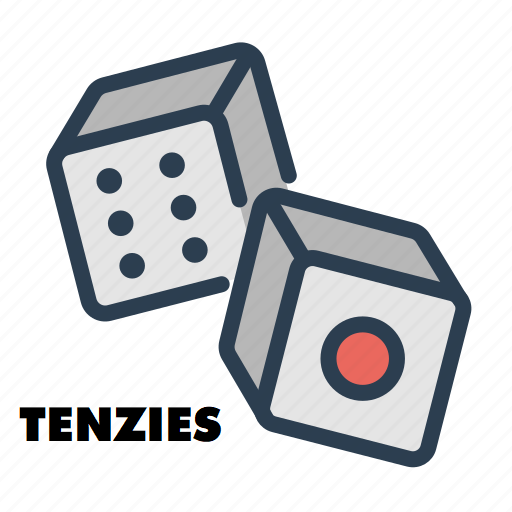

**" Rolling and Holding "**

# Overview
Tenzies is a web-based dice game built with React. The objective is to roll dice until all dice are the same number. Each roll, the user can choose which dice to keep. The game finishes when all dice show the same number.

The app provides great animation and physics for an engaging gameplay experience.

# Features 
* Roll dice with click of a button
* Select which dice keep between rolls
* Animations and physics for natural dice roll behavior
* Confetti animation on win
* Responsive design for mobile and desktop
* Number of rolls, time passing by tracking and saving
* Show best time for each level

# Tech Stack
> The game uses no back-end features
* React
* JavaScript
* HTML/CSS
* Bootstrap
* Libraries: 
  * react-confetti: for the confetti effect at the game winning
  * framer-motion: the core technology to make animations in the game

# Installation 
1. Clone the repo
2. Install all dependencies with `npm install` or (`npm i && npm run dev`)
3. Start development server with `npm start`

# Contact me at
* Your Name: **Khoa Nguyen**
* Email: nlydkhoa1024@gmail.com
* LinkedIn: https://www.linkedin.com/in/khoa-nguyen-ly/